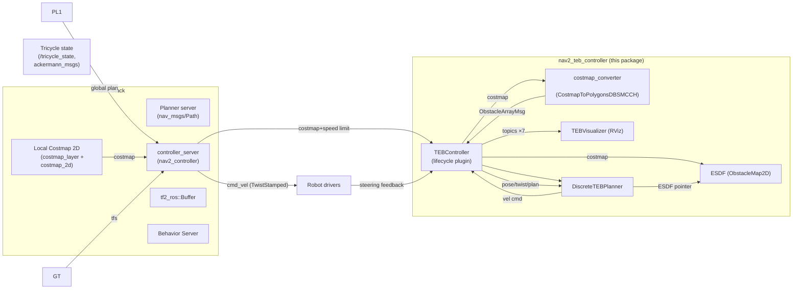
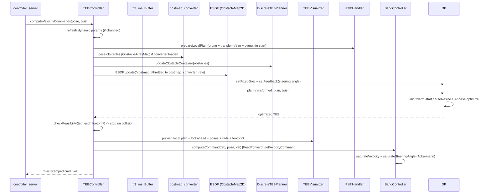
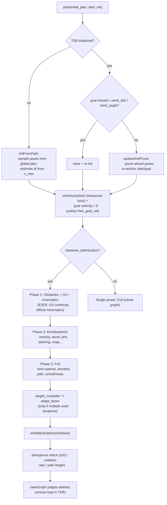
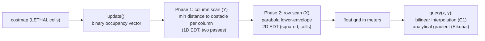
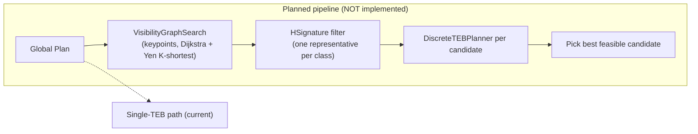

# Nav2 TEB Controller — Architecture

This document describes the system architecture of `nav2_teb_controller`, a Nav2 local controller plugin
implementing the **classic (discrete) Timed Elastic Band (TEB)** planner. It is written for developers
(including other agent sessions) who need to pick up the codebase quickly.

> **Companion docs**: [control_concept.md](control_concept.md) (TEB theory, g2o edge math, control law),
> [parameters.md](parameters.md) (parameter reference).

## 1. What this package is

- A **Nav2 `nav2_core::Controller` plugin** loaded by the Nav2 `controller_server` under a lifecycle-managed node.
- The **timed elastic band** is a sequence `s_0, s_1, …, s_{N-1}` of SE(2) poses together with time differences
  `Δt_0, …, Δt_{N-2}` between consecutive poses (data container: `TimedElasticBand`). There are **no splines** —
  poses are connected piecewise-linearly and all velocities / accelerations / jerks / snaps are estimated by
  **finite differences** (difference quotients).
- Deformation of the band is formulated as a **sparse nonlinear least-squares problem solved with g2o**
  (Gauss-Newton or Levenberg-Marquardt). Each pose (and each `Δt`) becomes a g2o *vertex*; every constraint
  (kinematics, dynamics, obstacle distance, target time) becomes a g2o *edge* whose error is weighted by an
  information matrix. Constraints are *soft* — implemented as linear penalty functions whose magnitude grows
  linearly outside the allowed interval.
- It supports **non-holonomic differential drive** (with forward-drive preference), **car-like / Ackermann**
  robots (minimum turning radius, steering rate, steering angle at goal), and — purely via configuration —
  a **holonomic mode** that switches to 3-DOF velocity / acceleration edges.

> (trap) **Not implemented (yet)**: Homotopy Class Planning (`hcp.activate` must stay `false` — see section 10),
> via-point constraints, preferred rotation direction, legacy costmap obstacle association, spline-based TEB-K.

## 2. System Context



Responsibilities in short:

| Component | Responsibility |
|---|---|
| `TEBController` | Nav2 plugin façade: lifecycle, parameter loading, per-tick pipeline (plan prep → optimize → verify → command). |
| `ObstacleMap2D` (ESDF) | Precomputed Euclidean distance field over the costmap (LETHAL cells), queried with bilinear interpolation + analytical gradient. |
| `DiscreteTEBPlanner` | Owns the `TimedElasticBand`, builds the g2o hyper-graph, runs optimization, writes back optimized values. |
| `Footprint` | Robot body model as N circles (polygon → radius-0 circles); used by `checkFeasibility` and the ESDF obstacle edge. |
| `TEBVisualizer` | Publishes 7 RViz topics (see section 9). |
| costmap_converter | (optional plugin) converts costmap cells into polygons/obstacles — used only for visualization / obstacle container; obstacle avoidance itself is ESDF-based. |

## 3. Control Loop (`computeVelocityCommands`)

`computeVelocityCommands` is called by the Nav2 controller server at `controller_frequency` for every world update.
It runs one complete planning cycle:



Details:

1. **Pruning** — `PathHandler::pruneGlobalPlan` erases global-plan poses closer than `global_plan_prune_distance`
   to the robot (in the plan frame).
2. **Transform & trim** — `PathHandler::transformAndTrimPlan` takes the global plan, transforms it into the costmap
   frame and clips it to a lookahead length (default `max_global_plan_lookahead_dist` = 5 m, but at most what was
   requested). The last included pose becomes `goal_idx`; if the trimmed window reaches the very end of the global
   plan the goal is treated as the final global goal (or `fix_goal` forces it).
3. **Start pose** — the front pose of the trimmed plan is overwritten with the *actual* robot pose, so the
   optimizer has marginally fresh starting conditions.
4. **Obstacles** — the optional costmap converter (polygons) is fed to `updateObstacleContainer`; the ESDF is
   refreshed on a throttled cadence (`costmap_converter_rate`).
5. **Planning / optimization** — `DiscreteTEBPlanner::plan()` (section 4).
6. **Feasibility** — hard check on the optimized TEB (section 6). If any footprint circle overlaps an LETHAL cell
   within `feasibility_check` [m] ahead, all control output is suppressed (`stop_cmd`).
7. **Velocity command** — `BandController::computeCommand` (selected by `path_tracker.type`; for `FeedForward` the
   default, `getVelocityCommand` extracts a lookahead velocity from `s0 → s_k` over window
   `k = control_look_ahead_poses`, bounded also by `dt_ref` and `min_time`, then `extractVelocity` computes the
   finite-difference velocity). `saturateVelocity` (common to all controllers) clips against `v_max_*`, optionally
   *proportionally* (`use_proportional_saturation`) so turning speed drops as the robot nears `v_max`.
8. **Steering limiting** — for Ackermann: `saturateSteeringAngle` converts the Twist to (speed, steering angle),
   rate-limits the angle by `steering_rate_max`, and converts back; the returned cmd is a `Twist` even for
   Ackermann robots (the angle is implicitly contained in `angular.z` and the driver reconstructs it).
9. **Output** — `TwistStamped cmd_vel`; on planner failure (`plan()` false or divergence) an empty twist is
   published (stopping).

## 4. Planner Pipeline (`DiscreteTEBPlanner`)



Phase logic (`optimizeTEB` / `runPhase`) in more detail:

- The iteration budget `no_inner_iterations`/`no_outer_iterations` is split equally over the 3 phases
  (± remainder to phase 3). `fast_mode` makes `autoResize` run at most once.
- **autoResize** happens *before* forming the graph of each phase: segments with `dt > dt_ref+dt_hyst` AND
  `len > max_seg_length`, or segments whose heading change exceeds `max_angle_diff`, are inserted; segments that
  are too short and have no significant angle are merged. Bounded by `min_samples`/`max_samples`.
- After each optimization run the edge weights are ramped by `weight_adapt_factor` (unless the last outer
  iteration), the classic *feasibility-first → target-function* TEB weighting.
- Optimization failures (chi-sq divergence, violation rate, path length explosion), empty optimizer batches, or
  a failed `row` result cause plan() to return `false`; the controller then emits a zero cmd_vel.

### g2o graph (from `buildGraph`)

**Vertices**: for pose `i` a `VertexPose` (3 DOF), for segment `i` a `VertexTimeDiff` (1 DOF). The start pose
**fixed forever** (`i==0`), the goal pose fixed when `final_goal_` (fix_goal) or the trimmed plan ends at the
global plan end.

**Edges** as built in `buildGraph` (see also [control_concept.md](control_concept.md) for math):

| Phase | Edge class | Vertices (poses / dts) | Error dim | Info weights (params) |
|---|---|---|---|---|
| Obstacles | `EdgeESDFObstacle` | 1 pose (pose i, interior 1…n−2) | 1 + #footprint circles | per-circle `weight_obstacle`·`weight_multiplier_`, center `weight_inflation`; Huber kernel |
| Obstacles | `EdgeG3Continuity` | 3 poses + 2 dts (sliding i: 0…n−3) | 1 | `weight_g3_continuity` |
| Obstacles | `EdgeKinematicsDiffDrive` | 2 poses (sliding) | 2 | `weight_kinematics_nh`, `weight_kinematics_forward_drive` |
| Obstacles | `EdgeKinematicsCarlike` (if ackermann) | 2 poses | 2 | `weight_kinematics_nh`, `weight_kinematics_turning_radius` |
| Kinodynamics | `EdgeVelocity` (or Holonomic if `v_max_y>0`) | 2 poses + 1 dt (sliding) | 2|3 | `weight_v_max_x`, `[weight_v_max_y,]`, `weight_v_max_theta` |
| Kinodynamics | `EdgeSnap` | 5 poses + 4 dt (sliding i−0…n−5) | 2 | `weight_snap_max_x`, `weight_snap_max_theta` |
| Kinodynamics | `EdgeSteeringAngleGoal` | last 5 poses (once) | 1 | `weight_zero_steering_angle_goal` |
| Kinodynamics | `EdgeGoalAngularVelocityZero` | last 5 poses + 4 dts (once) | 1 | `weight_goal_angular_vel_zero` |
| Kinodynamics | `EdgeAcceleration{Start,Goal}` (or Holonomic) | Start: 2P+1dt / Mid: 3P+2dt / Goal: 2P+1dt | 2|3 | `weight_a_max_x`, `[weight_a_max_y,]`, `weight_a_max_theta` |
| Kinodynamics | `EdgeSteeringRate{Start,Goal}` | Start: 2P+1dt / Mid: 3P+2dt / Goal: 2P+1dt | 1 | `weight_max_steering_rate` |
| Kinodynamics | `EdgeStartSteeringAngle` | first 3 poses + 2 dts (once) | 2 | `weight_start_steering_angle` |
| Kinodynamics | `EdgeJerk{Start,Goal}` | Start/Goal: 3P+2dt / Mid: 4P+3dt | 2 | `weight_jerk_max_x`, `weight_jerk_max_theta` |
| Full | `EdgeTimeOptimal` | unary → 1 dt (all segments) | 1 | `weight_time_optimal` |
| Full | `EdgeShortestPath` | 2 poses (sliding) | 1 | `weight_shortest_path` |
| Full | `EdgePathSmoothness` | 2 poses (sliding) | 1 | `weight_shortest_path` (trap) (see Gotchas) |

Edge wiring is performed by the generic factory `addEdgesGeneric<EdgeType, InfoDim>` with a single descriptor:

```
{n_poseVerts, n_timeDiffVerts, stride, offset, info_dim}
```

Semantics: for `offset ≥ 0` the loop runs `i ∈ [offset, n − stride)`; `stride = 0` runs exactly once at `offset`
(or at `n − n_poseVerts` when `offset < 0`, i.e. "last poses"). See [control_concept.md](control_concept.md) §5
for a precise table.

Memory: edges are created with `new` per graph build and destroyed by `clearGraph()`; the vertex–edge links are
cleared first (`vertices().clear()` + `optimizer->clear()`), so the `teb_` data inside the pose/dt vertices stays
alive (raw ownership is deliberate — clang-tidy checks disabled accordingly).

## 5. ESDF — `ObstacleMap2D`



- Update cadence: throttled in the controller loop to `costmap_converter_rate` (e.g. 2 Hz).
- Occupancy: cells with value ≥ `LETHAL_OBSTACLE` (254 by default — `update()` uses the costmap's
  `LETHAL_OBSTACLE` constant; the raw `uint8_t` overload accepts a threshold parameter).
- `query()` clamps out-of-range points to the grid boundary; returns `kOutOfBoundsDist = 1e6` if the map is
  uninitialized.
- Threading: `update()` must of course not run concurrently with `query()`; query is lock-free and safe to call
  from any thread (only 2 readers).

Consumers: `Footprint::check()` (feasibility, section 6) and `EdgeESDFObstacle` (soft motion, section on penalty).

## 6. Footprint & Feasibility

- **Footprint model**: circle decomposition. Either pass `model: "circles"` with `[x, y, r]` triplets or
  `model: "polygon"` (decomposed to radius-0 circles — upstream circle sweep is NOT applied here).
  `use_local_costmap: true` ignores `points` (the footprint is read later from the costmap footprint — for ESDF
  checks the internal circles are used, see Gotchas).
- **Circle check** (`Footprint::check`, `checkFeasibility`): for every TEB pose up to distance `lookahead`
  ahead of the robot, each footprint circle's center `c` is transformed into the world frame and the ESDF
  distance is compared against `d_min`:
  ```
  wx = x + cos*orig - sin*o.y   ;  wy = y + sin*orig + cos*o.y
  clearance = esdf.query(wx, wy).distance - circle_radius
  colliding = clearance < d_min
  ```
- `checkFeasibility` stops at the **first** colliding pose index and returns it (or -1 if the whole lookahead is
  free). The controller uses the result only to *suppress* its `cmd_vel` output — the planner keeps running.

## 7. Divergence Detection & Cost Monitoring

`hasDiverged()` (called after each phase):
1. **chi²**: last batch-statistics `chi2 > divergence_detection_max_chi_squared`.
2. **violation rate**: fraction of active edges whose own `chi2 > 1.0` exceeds `max_chi_violation_rate` (0.5).
3. **path length**: `teb.accumulatedDistance() > dt_ref·max_samples·v_max·max_path_length_factor`.

`computeCurrentCost()` (verbose mode) iterates the active edges, computes each `chi2()`, and reports a
per-edge-type cost breakdown (summation over every edge instance, `%` of total) — a quick way to debug weights.

## 8. Visualization

`TEBVisualizer` creates 7 lifecycle publishers (signaled as `visualization/activate: false` by default — check
the runtime config):

| Topic | Type | Content |
|---|---|---|
| `local_plan` | `nav_msgs/Path` | Optimized TEB as a path |
| `teb_lookahead_plan` | `nav_msgs/Path` | Trimmed lookahead window of the global plan |
| `teb_lookahead_goal` | `geometry_msgs/PoseStamped` | Last pose of lookahead window |
| `teb_poses` | `geometry_msgs/PoseArray` | TEB pose array |
| `teb_obstacles` | `MarkerArray` | Obstacle polygons/circles from costmap converter |
| `teb_radius_markers` | `MarkerArray` | Curvature radii (cylinder height ∝ radius, red=tight) |
| `footprint_markers` | `MarkerArray` | Footprint circle markers at colliding pose |

## 9. Homotopy Class Planning (TBD — not implemented)

The header structure (`homotopy/`) is designed for multi-topology planning: `HomotopyClassPlanner` (wrapper) +
`VisibilityGraphSearch` (graph search stack) + `HSignature` (complex-analysis based class filtering) +
`TebCandidate` (one TEB + homotopy class). **None of it is wired up**: `plan()` returns `false`, `search()`,
`build()`, `compute()` are stubs.



**Current status**: `hcp.activate` defaults to `false`; `configure()` logs an RCLCPP_ERROR if enabled (the stub
`plan()` would already fail). Do not plan to use it.

## 10. TODO / Extension Points

See the `Status` section in [AGENTS.md](../AGENTS.md); the mapping to code is:

- `HomotopyClassPlanner::plan()` (src/homotopy/homotopy_class_planner.cpp)
- `VisibilityGraphSearch::search()` (src/homotopy/visibility_graph_search.cpp)
- `HSignature::compute()`
- `AddEdgesViaPoints()` / `AddEdgesPreferRotDir()` (body-less)
- `AddEdgesObstacles()` legacy costmap association (unused)
- ESDF-aware autoResize
- recovery module params (`recovery.*`)
- `edge_jerk.h` vs `edge_jerk_new.h` duplicate cleanup